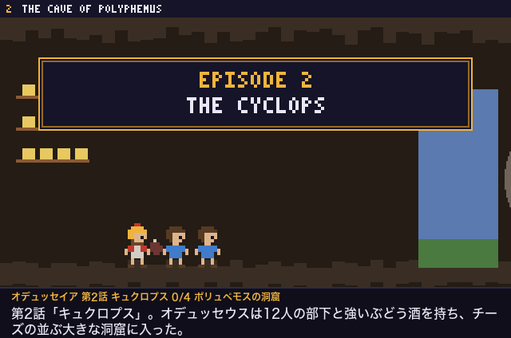
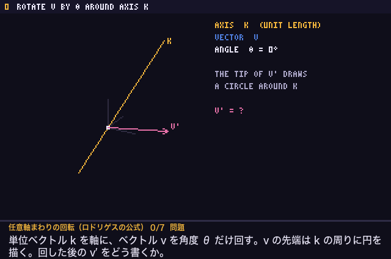

# scientific_anime_maker

[English](README.md) | 日本語

科学や数学の仕組みを説明する教材アニメーション GIF を、LLM に作らせるための道具一式です。

- **skill/** … 描画エンジンと書き出しツール。LLM（や人）は `scenes.js` を 1 つ書くだけで、字幕つきの GIF、ブラウザで動くプレビュー、自動検査の結果が得られます。
- **studio/** … Web ツール「Anim Studio」。テーマを入れると、LLM（既定は DeepSeek）が GIF を作り、**自分で出来を判定して、全場面が合格するまで作り直します**。

<p>


</p>

## 必要なもの

- Python 3.9 以上と Pillow（`pip install pillow`）
- ffmpeg（GIF の書き出しに使う）
- Google Chrome または Chromium（ヘッドレスで描画する）
- 日本語フォント（字幕に使う。mac は標準で入っている。Linux は Noto Sans CJK など）
- OpenAI 互換の Chat Completions API で使える LLM。**画像を読めるモデル**が必要（出来の判定で画面の画像を見せるため）

## 設定（LLM の接続先）

LLM の接続先・API キー・モデル名はコードに書かず、リポジトリ直下の `config.json` で設定します。
`config.json` は `.gitignore` に入っているので、手元の固有アドレスやキーがリポジトリに入ることはありません。

```sh
cp config.example.json config.json
```

```json
{
  "llm": {
    "url": "http://YOUR-LLM-HOST:8101/v1/chat/completions",
    "key": "YOUR-API-KEY",
    "model": "deepseek-v4.1-flash"
  },
  "port": 8777,
  "hires": 8,
  "gif_hires": 4,
  "small": { "hires": 1, "scale": 1 }
}
```

| 項目 | 意味 |
|---|---|
| `llm.url` | Chat Completions のエンドポイント（`…/v1/chat/completions` まで書く）。自分の LLM サーバー（例: LiteLLM や vLLM を置いたマシン）のアドレスに変える |
| `llm.key` | API キー（`Authorization: Bearer …` で送る）。不要なサーバーなら空文字 |
| `llm.model` | モデル名 |
| `port` | Anim Studio を開くポート |
| `hires` | 判定用のコマを描く解像度の倍率。8 なら 2560x1440 で描いて、縮めたり切り出したりして LLM に見せる |
| `gif_hires` | 完成した GIF を描く解像度の倍率。4 なら文字がなめらかになる（1 にすると 3x5 ドットのピクセルアートのまま） |
| `small` | 解像度を下げた版（`anim_small.gif`）の設定。`hires` は描く倍率、`scale` は出力の倍率。既定の 1 と 1 なら 320x212 のピクセルアート（音波の例で約 330KB。通常版は 640x424 で約 1.5MB） |

### Ollama でローカルのモデルを使う

`"api": "ollama"` にすると、Ollama 本来の `/api/chat` で呼び出し、呼び出しごとに文脈の長さを指定できます。
Ollama は既定の文脈の長さが極端に短いことがあり、約 2.3 万トークンのプロンプトが黙って切られるので、文脈を長くしたモデルも作っておきます。

```sh
printf 'FROM qwen3.8:27b\nPARAMETER num_ctx 262144\n' > Modelfile
ollama create qwen3.8:27b-256k -f Modelfile
```

```json
{
  "llm": { "api": "ollama", "url": "http://localhost:11434", "key": "", "model": "qwen3.8:27b-256k", "num_ctx": 262144, "think": false },
  "port": 8778
}
```

`think: true` にすると、考える過程を出すモデルではそれも画面に表示されます（そのぶん遅くなる）。
`config.qwen.json` のような名前で保存し（Git には入らない）、`SAM_CONFIG=config.qwen.json python3 studio/server.py` で、既定の Studio と並べてもう 1 つ動かせます。

設定の優先順位は **環境変数 > config.json > 既定値** です。

- 環境変数 `SAM_LLM_URL` / `SAM_LLM_KEY` / `SAM_LLM_MODEL` / `PORT` で一時的に上書きできます。
- `SAM_CONFIG=/path/to/other.json` で、別の設定ファイルを使えます（接続先を複数使い分けるとき）。
- Anim Studio の画面の「接続設定」に入れると、そのジョブだけ接続先を変えられます。

## Anim Studio（Web ツール）

```sh
python3 studio/server.py
# → http://localhost:8777 を開く
```

左の欄にテーマと場面の流れ（空欄ならおまかせ）、場面数・秒数・最大回数を入れて「作り始める」を押します。
右側に、いま LLM が書いている内容（ストリーミングで表示。モデルが出せば考える過程も）、回ごと・場面ごとの点数、判定の理由（確認項目ごとの「はい／いいえ」と LLM が見た実際の様子）、
確認画像、動くプレビュー、完成した GIF、ログが出ます。ジョブは `studio/jobs/` に保存され、サーバーを再起動しても残ります。

処理の流れ:

1. **生成** — `skill/` の手順書・描画エンジン・見本を LLM に渡し、`scenes.js` を書かせる。各場面には次の 2 つも書かせる。
   - `expect`: 静止画で確かめられる「こうなっているはず」の項目（部品どうしの位置関係・形・重なり）
   - `moves`: 動く・点滅するはずの部品と、その範囲
2. **自動検査** — `build_gif.py` で全コマを描き、プログラムで調べる: 例外・フォントにない文字・はみ出し・文字の重なり・数値の検算・
   `moves` の範囲が本当に変化しているか（全コマの最大と最小の差で測る）。
3. **見た目の判定**（自動検査の結果は渡さない）— 3 段階で行う。
   1. `expect` の各項目を、**正解を含まない中立な質問**に言い換えさせる（文字だけ）。
   2. 正解を知らせずに、画像を見たまま答えさせる。画像は 15% / 35% / 55% / 80% のコマ（時刻順）、場面全体で変化した場所を赤く示した変化マップ、
      80% のコマを 4 分割して拡大したもの。判定用のコマだけを 8 倍の解像度で描き直す。
   3. 観察結果と `expect` を突き合わせて合否と点数を出させる（文字だけ）。
4. **場面の合格** = 見た目の判定が合格 かつ その場面の自動検査に問題なし。合格した場面は固定し、以後は判定も修正もしない。
5. **修正** — 不合格の場面だけを、判定の指摘・自動検査の結果・画像を渡して書き直させる。直した結果が壊れていたら（描けない・場面を切り出せない・例外）取り消す。
6. 全場面が合格するか、最大回数に達するか、点数が決まった回数続けて伸びなくなったら終わる。
7. **組み立て** — 場面ごとに一番良かった版（①合格 ②致命的な問題がない ③点数が高い、の順）を使って GIF を作る。
   合格しなかった場面は、合格ライン以上で致命的な問題がなければ使い、届かなければ省く。何を使い何を省いたかは画面に出る。
   GIF は通常版（`anim.gif`）と、解像度を下げた軽い版（`anim_small.gif`）の 2 つを書き出す。

## skill/ だけを使う

`skill/SKILL.md` が手順書です。Claude Code などのエージェントのスキルとしてそのまま使えます（`~/.claude/skills/pixel-anim-gif/` に置く）。
別の LLM に使わせるときは、`SKILL.md`・`pixel.js`・`example_scenes.js` をシステムプロンプトに入れて `scenes.js` を書かせます。

```sh
python3 skill/build_gif.py scenes.js -o out.gif --title "題名" --lint-only   # 検査と確認画像だけ
python3 skill/build_gif.py scenes.js -o out.gif --title "題名"               # GIF まで
python3 skill/build_gif.py scenes.js -o out.gif --hires 4 --frames-dir frames # 高解像度で描く
```

出力: `out.gif`（字幕つき GIF）、`out_preview.html`（ブラウザで動くプレビュー）、`out_sheet.png`（各場面の途中 2 コマを並べた確認画像）。

## わかったこと（DeepSeek v4.1 Flash で試した結果）

- **スキルなしでは文字が読めない。** 自作のビットマップフォントが壊れる。検証済みのフォントと部品を渡すと、ほぼ全場面が動くコードになる。
- **画面の式は、表示する文字列そのものを検算させる。** 別に書いた計算用の関数どうしを比べるだけの検算では、画面の符号の誤りを見逃す（`checkExpr()`）。
- **全体を書き直させると、直したはずの場面が元に戻る。** 問題のある場面だけを書き直させると確実に直る。場面は括弧の対応で切り出す（字下げに頼ると取り違える）。
- **存在しない部品を推測で使う。** 場面の外で定義されている名前の一覧を渡すと直る。
- **縮めた画像はほぼ読めない。** 判定用のコマは高解像度・なめらかなフォントで描く。ただし**解像度を上げるだけでは足りない。**
- **正解を示して聞くと「はい」と答える。** 「L2 の線は水平か」と聞くと、斜めでも「はい」。正解を伏せた中立な質問に言い換え、見たままを答えさせてから、別の段階で突き合わせる。
- **色の名前・見出し・薄い補助線で落とさない。** 金とオレンジのような呼び方の違い、背景に近い色の線は、画像の判定では当てにならない。確認項目に書かせず、判定でも問題にしない。
- **動きは画像から読み取れない。** 抜き出したコマや変化マップを見せても、点滅を「変わらない」と答えることがある。動きは `moves` で範囲を指定し、プログラムで全コマの変化を測る。
- **数ドットのずれは数値で捕まえる。** 図の座標を少数の変数から計算させ、部品どうしの関係（「箱の下端 = 板の上面」など）を `check()` で検算させる。
- **自動検査と見た目の判定は分ける。** 自動検査の結果を判定に渡すと、「自動検査が通っている」という項目を作って落とすなど、役割が混ざる。
- **判定はばらつく。** 一度合格した場面を判定し直すと落ちることがある。合格した場面は固定し、場面ごとに一番良かった版を残す。
- **ローカルの 27B モデルでも、時間をかければできる。** Qwen3.8 27B（Ollama、M4 Max）は音波の例で 5 回目に 3 場面とも合格した（約 2 時間 10 分。DeepSeek は 6 回目・約 20 分）。
  ただし判定は、単位の誤り（λ = 68 m を 68 MM と表示）や文字の重なりを見逃した。一度だけ、コードを含まない短い返事で終わったので、その場合は 1 回だけ書き直させるようにした。
- **画像を大きくしすぎると、サーバーによっては GPU メモリが足りなくなる。** 1 枚は 1280x720 までにし、足りなければ小さくして送り直す。

## 構成

```
config.example.json   接続先の雛形（config.json にコピーして使う）
skill/
  SKILL.md            手順書（場面の分け方、規約、部品、検算、レイアウトの注意）
  pixel.js            描画エンジン（3x5 フォント、図形、配線、行列、3D、グラフ、スプライト、検算、高解像度モード）
  build_gif.py        検査・確認画像・プレビュー・GIF の書き出し
  example_scenes.js   2 場面の見本
studio/
  server.py           Web サーバー（標準ライブラリだけで動く）
  pipeline.py         生成・検査・判定・修正の流れ
  index.html          画面
examples/
  reference_scenes.js LLM に渡す作例（オデュッセイア第 2 話）
  *.gif               作例
```

## ライセンス

[Apache License 2.0](LICENSE)
